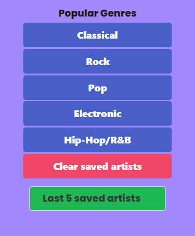
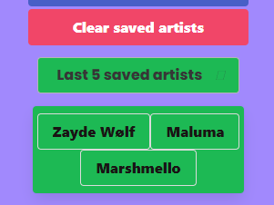

# Song Safari

Embark on a guided journey through musical subgenres, discovering new sounds or finding familiar tracks.
SongSafari is not just an app; it's your ticket to explore the vast landscape of music.

## Installation

No login or sign-up required! Simply follow this link: [SongSafari](https://kathrynfisher3700.github.io/songSafari/)

## Usage

🎷SongSafari is easy to navigate. 
To begin, click on the top tabs to see the available genres. 

➡️ Next, choose a genre to explore. These 🔵blue buttons will appear on the left side of the screen. 

➡️ Once your **genre** is selected it will turn ⚪white, and you'll notice a selection of subgenres populate in the tabs. 

➡️ Once the **subgenre** is selected, a list of popular artists will appear in 🟢green. 

➡️Click an artist's name to get more information. *Only then* will the Youtube video, Youtube link, and Spotify information appear.

🎺COOL FEATURE! Find an artist that you like and want to keep-in-mind for later? 
➡️ Choose "Click to save!" to come back and continue exploring the artist's music. 

 

➡️ Find your saved list under the main genre buttons - hover to view.

## Authors

[Kathryn Dougherty](https://github.com/kathrynfisher3700)

[Frieda Fry](https://github.com/friedahf)

[Yasin Hubbard](https://github.com/hubbard1118)

[Kurt Riecken](https://www.github.com/kurriecken)

## Resources

Youtube API & Spotify API.

Special thanks to our UCF bootcamp instructors for support and guidance. 

## License

[MIT](https://choosealicense.com/licenses/mit/)